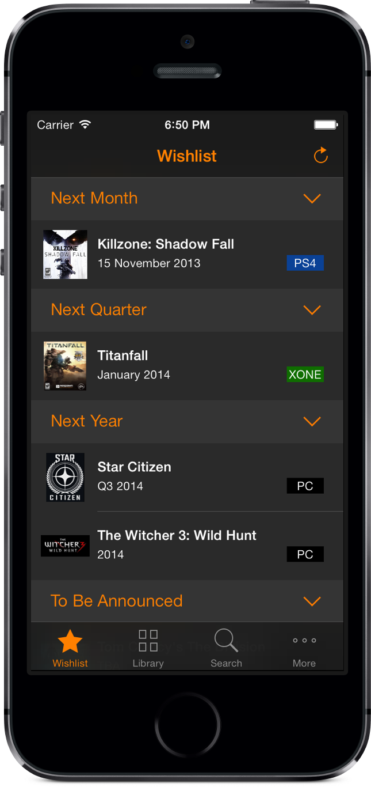
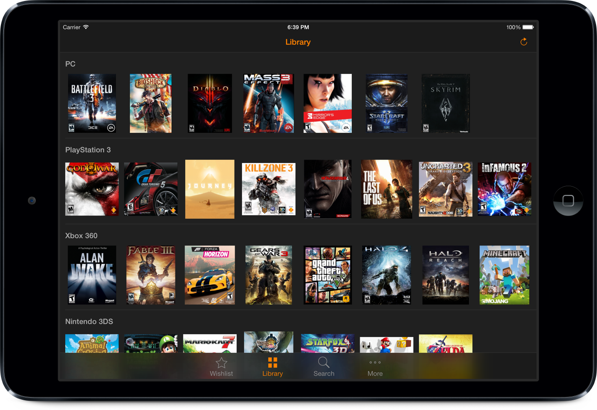

Gamer
=====

Gamer is a tool for exploring, organizing and keeping track of all our games.
  
  

  
  

Credits
=====

Game information and media comes from the GiantBomb Wiki at [GiantBomb](http://www.giantbomb.com).

Metascore comes from [Metacritic](http://www.metacritic.com).

Contributing
=====

This app is open source from the start so that everyone can help in developing it.

All data in the GiantBomb Wiki comes from its users, and a great way to improve this app is contributing to the wiki, therefore I encourage you to create an account on [GiantBomb](http://www.giantbomb.com) and help in making it even better.

For features, bugs or suggestions, please open a new [issue](https://github.com/caiomello/gamer/issues) with the appropriate labels, or [send an email](mailto:gamer.app@icloud.com).

I've also created a [public Trello board](https://trello.com/b/RlCG5Bxi/gamer) so you can check on the ideas I've had and what I'm currently doing.

License
=====

**You're welcome to check out the code, suggest or make new features and report or fix bugs, all I ask is that you give credit where it's due and don't use it on another app with similar goals.**

**And of course please don't submit this code to the App Store. The idea here is having an app that we can all work together to improve.**

Gamer is available under the GPL license. See the LICENSE file for more info.
